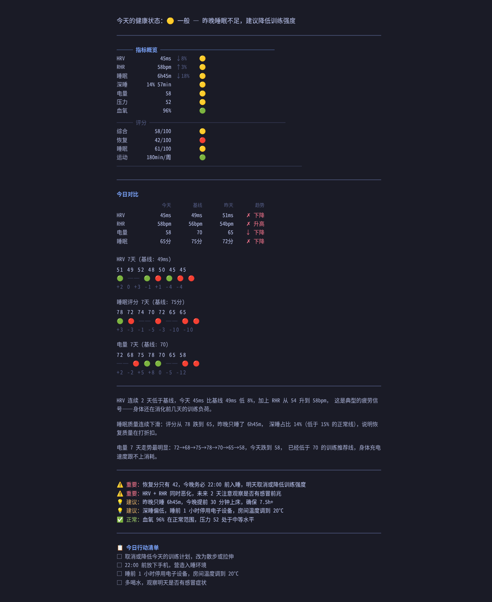

# Zepp Health Skill

[English](#english) | [中文](#中文)

---

## English



LLM-driven analysis of Zepp/Amazfit health data with personalized recommendations.

Works with OpenClaw or hermes-agent.

### Install

```bash
# Clone to hermes-agent skill directory
git clone https://github.com/n0Pnyk/zepp-health-skill.git ~/.hermes/skills/smart-home/zepp-health

# Install dependencies
pip install httpx pydantic rich python-dotenv

# Configure authentication
cd ~/.hermes/skills/smart-home/zepp-health
cp config.example.json config.json
```

Edit `config.json` with your Zepp API credentials:

```json
{
  "app_token": "your_app_token_here",
  "user_id": "your_user_id_here",
  "host": "api-mifit-cn3.zepp.com"
}
```

Get your credentials:

1. Open https://user.huami.com/privacy2/index.html and log in
2. Open browser Developer Tools (F12) → **Application** tab → **Cookies** → `user.huami.com`
3. Copy the `apptoken` and `userid` values from the cookies

> No packet capture, no proxy, no root, no phone needed. Just a desktop browser.

> Token expires after ~30 days. When data returns null, re-extract a new token.

Alternatively, use environment variables:

```bash
export ZEPP_COOKIE="userid=xxx; apptoken=xxx; region=1"
```

### Update

```bash
cd ~/.hermes/skills/smart-home/zepp-health
git pull
```

Your `config.json` is in `.gitignore` and will NOT be overwritten. If `SKILL.md` has local modifications, git will prompt you to resolve the conflict.

### Usage

In OpenClaw or hermes-agent, say:

- "Analyze my health data"
- "How did I sleep last night?"
- "What's my recovery status?"
- "Check my training load"

### Manual Testing

```bash
cd ~/.hermes/skills/smart-home/zepp-health
python3 scripts/health_snapshot.py                  # Today's data
python3 scripts/health_snapshot.py --date 2026-05-18 # Specific date
```

### Project Structure

| File | Purpose |
|------|---------|
| `SKILL.md` | Skill definition, triggers, and analysis framework |
| `scripts/health_snapshot.py` | Data fetch script, outputs JSON |
| `references/health_analysis_guide.md` | LLM analysis reference guide |
| `zepp_health/` | Core library (data fetching, normalization, scoring) |
| `config.json` | Your local config (not tracked by git) |
| `sync_from_cli.sh` | Sync core library from CLI repo (maintainers only) |

### CLI vs Skill

| Mode | Recommendations | Personalization | Dependencies |
|------|----------------|-----------------|--------------|
| [zepp-health CLI](https://github.com/n0Pnyk/zepp-health-analytics) | Rule engine | Generic | Python |
| zepp-health-skill | LLM analysis | Highly personalized | LLM service |

### Safety Boundaries

The LLM will recommend seeking medical attention (without diagnosing) when:
- SpO2 < 90%
- Resting heart rate anomaly exceeds 20% above baseline
- HRV persistently low (30%+ below baseline)

### Intended Use

This project is for **personal use, academic research, and educational purposes only**. It accesses your own Zepp/Amazfit health data using your own credentials. Not intended for commercial use or mass data collection.

### Disclaimer

- **Not medical advice.** All outputs are for informational reference only. Consult a healthcare professional for any health concerns.
- **Unofficial tool.** This project uses reverse-engineered API endpoints and is not affiliated with, endorsed by, or connected to Zepp Health (Huami/Amazfit).
- **User responsibility.** Users are responsible for compliance with the Zepp platform Terms of Service in their jurisdiction.
- **No warranty.** Provided "as is" without any warranty. The authors are not liable for any damages arising from use of this software.

### License

[MIT License](LICENSE)

---

## 中文


LLM 驱动的 Zepp/Amazfit 健康数据分析，提供个性化建议。

配合 OpenClaw 或 hermes-agent 使用。

### 安装

```bash
# 克隆到 hermes-agent skill 目录
git clone https://github.com/n0Pnyk/zepp-health-skill.git ~/.hermes/skills/smart-home/zepp-health

# 安装依赖
pip install httpx pydantic rich python-dotenv

# 配置认证
cd ~/.hermes/skills/smart-home/zepp-health
cp config.example.json config.json
```

编辑 `config.json`，填入你的 Zepp API 认证信息：

```json
{
  "app_token": "your_app_token_here",
  "user_id": "your_user_id_here",
  "host": "api-mifit-cn3.zepp.com"
}
```

获取认证信息：

1. 打开 https://user.huami.com/privacy2/index.html 并登录
2. 打开浏览器开发者工具（F12）→ **Application** 标签 → **Cookies** → `user.huami.com`
3. 从 Cookie 中复制 `apptoken` 和 `userid` 的值

> 无需抓包、无需代理、无需 root、无需手机。一个桌面浏览器就够了。

> Token 约 30 天过期。数据返回 null 时，重新提取 token 即可。

也可以用环境变量：

```bash
export ZEPP_COOKIE="userid=xxx; apptoken=xxx; region=1"
```

### 更新

```bash
cd ~/.hermes/skills/smart-home/zepp-health
git pull
```

`config.json` 在 `.gitignore` 中，**不会被覆盖**。如果 `SKILL.md` 有本地修改，git 会提示你解决冲突。

### 使用

在 OpenClaw 或 hermes-agent 中说：

- 「分析我的健康数据」
- 「今天睡眠怎么样」
- 「我的恢复状态如何」
- 「帮我看看训练负荷」

### 手动测试

```bash
cd ~/.hermes/skills/smart-home/zepp-health
python3 scripts/health_snapshot.py                  # 今日数据
python3 scripts/health_snapshot.py --date 2026-05-18  # 指定日期
```

### 项目结构

| 文件 | 用途 |
|------|------|
| `SKILL.md` | Skill 定义，触发条件和分析框架 |
| `scripts/health_snapshot.py` | 数据获取脚本，输出 JSON |
| `references/health_analysis_guide.md` | LLM 分析参考指南 |
| `zepp_health/` | 核心库（数据拉取、归一化、评分） |
| `config.json` | 本地配置（不纳入 git 管理） |
| `sync_from_cli.sh` | 从 CLI 仓库同步核心库（维护者用） |

### 与 CLI 的区别

| 模式 | 建议来源 | 个性化程度 | 依赖 |
|------|----------|------------|------|
| [zepp-health CLI](https://github.com/n0Pnyk/zepp-health-analytics) | 规则引擎 | 通用 | Python |
| zepp-health-skill | LLM 分析 | 高度个性化 | LLM 服务 |

### 安全边界

以下情况会建议就医，不做诊断：
- SpO2 < 90%
- 静息心率异常升高超过基线 20%
- HRV 持续异常偏低（低于基线 30%+）

### 使用范围

本项目仅供**个人使用、学术研究和教育用途**。使用用户自己的凭证访问自己的 Zepp/Amazfit 健康数据，不用于商业用途或大规模数据采集。

### 免责声明

- **非医疗建议。** 所有输出仅供参考，不构成医疗建议。如有健康问题请咨询专业医生。
- **非官方工具。** 本项目使用逆向工程 API 接口，与 Zepp Health（华米/Amazfit）无关联、无授权、无合作关系。
- **用户责任。** 用户需自行确保符合所在地区 Zepp 平台服务条款。
- **无担保。** 按"现状"提供，不作任何担保。作者不对使用本软件造成的任何损害承担责任。

### 许可证

[MIT License](LICENSE)
